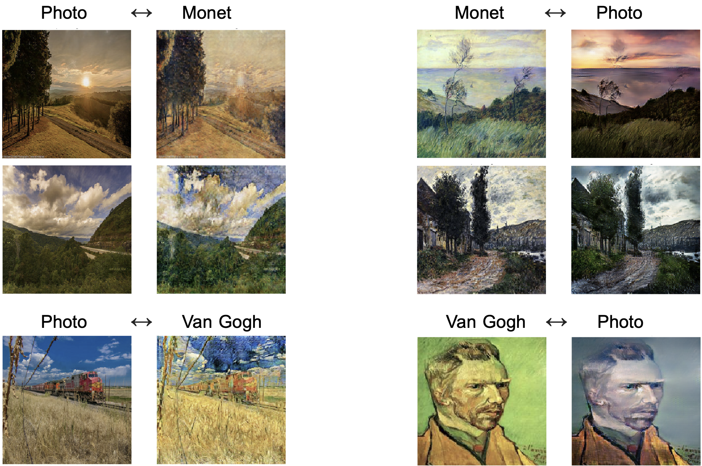

# DS-CycleGAN
## Diversity Sensitive Unpaired Image-to-Image Translation
By Chris Zhou and Leo Hu

### Contents
1. We provide an implementation of [cycleGAN](https://arxiv.org/abs/1703.10593) in Tensorflow 2.0 and Keras.

2. We propose a new model architecture that adds diversity to cycleGAN outputs, achieving multimodal unpaired image-to-image translation. We achieve this by introducing a diversity sensitive regularizer proposed by [DS-CGAN](https://arxiv.org/abs/1901.09024) to the cycleGAN model.

3. We apply DS-CycleGAN to a data augmentation task in medical imaging by converting healthy red blood cells <-> malaria infected red blood cells.

### Quick start
In this repository we provide three notebook files to perform the following:
- Transform an image using our pre-trained models in `Transform.ipynb`. Both cycleGAN and DS-CycleGAN models are provided
- Train a new model using database(s) of choice `Train.ipynb`
- Examine possible medical applications of diverse unpaired image-to-image translation using malaria cells `Malaria.ipynb`

### Colab Notebooks
[Transform](https://drive.google.com/file/d/1X8TbLc624WJaM-FbGbRBuW-bGkCAyMrg/view?usp=sharing)
[Train](https://drive.google.com/file/d/1DS1j4QVpCAKwjUuEUQr9dmXugGdM7gz8/view?usp=sharing)

### Motivation
CycleGAN is able to generate quality image-to-image outputs from an unpaired dataset, but is limited to a single output image given a single input image.

DSGAN uses a latent vector input alongside a regularizer to generate multimodal outputs, but uses a paired dataset when training.

DS-CycleGAN is able to generate diverse outputs using cycle-consistent adversarial networks in unpaired image-to-image translation.

One slide illustration of DS-CycleGAN

### Example outputs of CycleGAN

### Example outputs of DS-CycleGAN

### Limitations
DS-CycleGAN generates outputs that are limited to differences in pixel intensity. That is, we achieve great diversity in the outputs with differences in the color, brightness, and contrast, but we would like to see more textural differences amongst varying outputs.

### Acknowledgements
- **[Unpaired Image-to-Image Translation using Cycle-Consistent Adversarial Networks](https://arxiv.org/abs/1703.10593)**
- **[Diversity-Sensitive Conditional Generative Adversarial Networks](https://arxiv.org/abs/1901.09024)**
- Thanks to **[Ouwen Huang](https://github.com/Ouwen)** for advice in this project.
